<p align="center">
  
</p>

<h1 align="center">Arcframe</h1>

<p align="center"><strong>The engineering control plane for Cursor</strong></p>

<p align="center">
  Local-first repository intelligence for Cursor MCP and AI coding agents.<br />
  Arc Index, Arc Graph, blast-radius impact analysis, and evidence-backed context.<br />
  Analysis stays on your machine.
</p>

<p align="center">
  <a href="https://github.com/theworker02/arcframe/actions/workflows/ci.yml"></a>
  <a href="./LICENSE"></a>
  <a href="./CHANGELOG.md"></a>
  <a href="./docs/mcp.md"></a>
  <a href="https://theworker02.github.io/arcframe/"></a>
  <a href="https://theworker02.github.io/arcframe/docs/"></a>
  <a href="https://github.com/theworker02/arcframe/releases"></a>
  <a href="https://cursor.directory/u/theworker02"></a>
</p>

<p align="center">
  <a href="https://github.com/theworker02/arcframe">Repo</a>
  &nbsp;·&nbsp;
  <a href="https://theworker02.github.io/arcframe">Site</a>
  &nbsp;·&nbsp;
  <a href="https://theworker02.github.io/arcframe/docs/">Docs</a>
  &nbsp;·&nbsp;
  <a href="https://cursor.directory/u/theworker02">Cursor Directory</a>
  &nbsp;·&nbsp;
  <a href="https://github.com/theworker02/arcframe/releases">Releases</a>
  &nbsp;·&nbsp;
  <a href="https://github.com/sponsors/theworker02">Sponsors</a>
</p>

---

## What / Why

Arcframe is infrastructure for serious engineering work inside Cursor: a **control plane** over your repository, not a chat wrapper.

It answers operational questions with labeled evidence — *Confirmed*, *Strongly inferred*, *Weakly inferred*, *Unknown* — instead of unverifiable certainty. The same engines power the CLI, MCP server, Cursor UI, and workflow prompts so agents and humans share one source of truth.

| Principle | Practice |
|-----------|----------|
| Local-first | Index and graph live under `.arcframe/`; core operation needs no Arcframe account |
| Evidence over assumptions | Analytical claims carry confidence + sources |
| Incremental by default | Content hashes + SQLite; full rescans are explicit (`rebuild`) |
| One engine | No duplicate analyzers across CLI vs MCP vs plugin |
| Safe automation | Reads are automatic; destructive ops need explicit intent; **never** auto-push |

---

## Architecture

```mermaid
flowchart LR
  subgraph Surfaces
    CLI["CLI · arc / arcframe"]
    MCP["MCP · servers/mcp"]
    Plugin["Cursor plugin"]
  end
  subgraph Engine["Shared engine"]
    Core["@arcframe/core"]
    Analyzer["analyzer"]
    Graph["graph"]
    Context["context"]
    Memory["memory"]
    Eng["engineering"]
    Store["storage · SQLite"]
  end
  CLI --> Core
  MCP --> Core
  Plugin --> Core
  Core --> Analyzer & Graph & Context & Memory & Eng & Store
```



Thin surfaces, one engine. Local state lives under `.arcframe/` (SQLite, cache, rules, `mcp.json`).

| Package / path | Role |
|----------------|------|
| `@arcframe/core` | Config, paths, cache, events, DI, permissions, project identity |
| `@arcframe/storage` | SQLite (`node:sqlite`) |
| `@arcframe/analyzer` | Arc Index, language adapters, FS watcher |
| `@arcframe/graph` | Arc Graph + impact |
| `@arcframe/memory` | Memory, sessions, tasks, decisions |
| `@arcframe/context` | Budgeted context packs |
| `@arcframe/engineering` | Git inspect, health, doctor, test/build/validate/review/changes |
| `@arcframe/workflows` | Arc Flows |
| `cli` | `arc` / `arcframe` binaries → `cli/dist/bin.js` |
| `servers/mcp` | MCP tools, resources, prompts (`@arcframe/mcp`) |
| `apps/cursor-plugin` | Cursor/VS Code sidebar + commands |
| `apps/docs` | VitePress documentation site |
| `rules/`, `skills/`, `agents/`, `commands/` | Open Plugins rule pack, skills, agents, commands (repo root) |
| `mcp.json` / `plugin.json` / `.cursor-plugin/` | Open Plugins / Agent Plugins manifests + MCP |
| `adapters/` | Language / framework / tool adapter layout |
| `native/` | Optional Rust/Go accelerators (`arcframe-hashwalk`, `arcframe-gitmeta`) — see [native/README.md](./native/README.md) |

TypeScript remains the control plane. Native binaries are optional: discovered via `ARCFRAME_NATIVE_DIR`, `native/bin/`, crate build outputs, or `PATH`, with graceful JS fallback when missing (`pnpm native:build`).

---

## Features

- **Arc Index** — incremental file/symbol index with watch (native + polling fallback)
- **Arc Graph** — `IMPORTS`, `DEPENDS_ON`, `CONTAINS`, `TESTS`, `ROUTES_TO`, and related edges with confidence
- **Budgeted context packs** — `tiny` → `unlimited` token budgets with scored, reasoned items
- **Arc Memory** — notes, ADRs/decisions, sessions, and tasks in local SQLite
- **Impact analysis** — dependents/dependencies from the graph for a file or node
- **Engineering ops** — doctor, health, validate, test, build, review, changes, API compatibility, docs checks
- **MCP server** — **136** precise tools, plus resources and prompts (not a single dump-everything tool)
- **Rules + skills** — repo rule pack and evidence-first skill prompts
- **Language adapters** — TypeScript, JavaScript, Rust, Python, Go, plus framework route heuristics

---

## Install

Live site: [https://theworker02.github.io/arcframe](https://theworker02.github.io/arcframe) · Docs: [https://theworker02.github.io/arcframe/docs/](https://theworker02.github.io/arcframe/docs/)

Arcframe is **GitHub-first** — all workspace packages are `"private": true` and are **never** published to the npm registry. Do not use `npm install -g @arcframe/…`.

| Surface | Install path |
|---------|----------------|
| CLI | Clone → `pnpm install && pnpm build` → `node ./cli/dist/bin.js` |
| MCP | Same build → point Cursor at `servers/mcp/dist/index.js` (or install as Open Plugin) |
| Cursor Open Plugin | [cursor.directory/u/theworker02](https://cursor.directory/u/theworker02) or add this GitHub repo in Cursor Plugins (discovers `rules/`, `skills/`, `mcp.json`, …) |
| Cursor VSIX plugin | Download VSIX from Releases, or `pnpm --filter ./apps/cursor-plugin package:vsix` → Install from VSIX |
| Releases | Tag `v*` artifacts (VSIX + node tarball) — see [DISTRIBUTION.md](./DISTRIBUTION.md) |

Full distribution notes: **[DISTRIBUTION.md](./DISTRIBUTION.md)**.

---

## Quick start

Requires **Node.js >= 22.5** (built-in `node:sqlite`) and **pnpm 9** (`packageManager`: `pnpm@9.15.9`).

```bash
git clone https://github.com/theworker02/arcframe.git
cd arcframe
pnpm install
pnpm build
node ./cli/dist/bin.js init
node ./cli/dist/bin.js status
node ./cli/dist/bin.js health
```

Convenience aliases after build (from the monorepo root):

```bash
pnpm arc -- help
# or
node ./cli/dist/bin.js <command> [--json] [--cwd <path>]
```

Root `package.json` also exposes `bin` names `arc` and `arcframe` → `./cli/dist/bin.js`.

Dogfood shortcut:

```bash
pnpm dogfood   # init + status + health
```

---

## Cursor integration

Official listing: **[cursor.directory/u/theworker02](https://cursor.directory/u/theworker02)**

### Open Plugin (rules, skills, agents, commands, MCP)

This repository follows the [Cursor Plugins](https://cursor.com/docs/reference/plugins) / [Agent Plugins](https://agent-plugins.org) layout at the **repo root** so Cursor can discover components when you add the GitHub repo as a plugin:

| Path | Contents |
|------|----------|
| `.cursor-plugin/plugin.json` | Cursor Plugin manifest |
| `plugin.json` | Agent Plugins 1.0 manifest |
| `rules/*.mdc` | Engineering rule pack (20 rules) |
| `skills/<name>/SKILL.md` | Bug Investigator, Feature Builder, Refactor Planner |
| `agents/*.md` | Investigator / Implementer / Reviewer personas |
| `commands/*.md` | Status, health, reindex, impact, context, investigate |
| `mcp.json` / `.mcp.json` | stdio MCP → `servers/mcp/dist/index.js` (`${PLUGIN_ROOT}`) |

**Install**

1. Install from **[cursor.directory/u/theworker02](https://cursor.directory/u/theworker02)**, or clone / add from GitHub: `https://github.com/theworker02/arcframe`.
2. In the Arcframe checkout: `pnpm install && pnpm build` (MCP requires `servers/mcp/dist/index.js`).
3. Enable the plugin in Cursor. MCP starts with `ARCFRAME_ROOT=${PLUGIN_ROOT}` (indexes the plugin/repo root by default).
4. To analyze a different project, set `ARCFRAME_ROOT` to that project path, or run `node ./cli/dist/bin.js init` there and use project MCP settings.

Validate discovery locally: `pnpm sync:open-plugin` (or `node ./scripts/sync-open-plugin.mjs`).

Root Open Plugin files are the **canonical** sources for rules/skills/agents/commands/MCP manifests. The activity-bar VSIX under `apps/cursor-plugin` is a separate UI surface.

### Classic setup (clone + MCP / VSIX)

1. Build the repo (`pnpm build`).
2. Run `node ./cli/dist/bin.js init` in the target project (or this monorepo).
3. Wire MCP using `.arcframe/mcp.json` (written on init) or your Cursor MCP settings.
4. Optionally build/load `apps/cursor-plugin` for the activity-bar sidebar (`Status`, `Health`, `Rebuild Index`).

Cursor public APIs only — see [docs/cursor-api-limitations.md](./docs/cursor-api-limitations.md).

---

## MCP

**Verified tool count: 136** distinct MCP tools (registry + handler coverage scripts; server process dogfood).

```bash
pnpm --filter @arcframe/mcp build
node ./servers/mcp/dist/index.js
# verify: node ./scripts/count-mcp-tools.mjs && node ./scripts/verify-mcp-tools.mjs
```

Or via the root script after build: `pnpm dev:mcp`.

**Cursor MCP config** (also written to `.arcframe/mcp.json` on `arc init`):

```json
{
  "mcpServers": {
    "arcframe": {
      "command": "node",
      "args": ["<path-to-repo>/servers/mcp/dist/index.js"],
      "env": { "ARCFRAME_ROOT": "<path-to-repo>" }
    }
  }
}
```

The tool surface is expansive and precise: repository, symbols, graph, impact, context, memory, decisions, sessions, tasks, git, tests, validate, review, changes, debug, deps, command intelligence, ownership, workspace/monorepo, adapters, flows, rules, env (names only, never values), db schema, CI/release helpers, unified search, security patterns, and performance signals. Agents call the right tool rather than a monolithic dump.

Resources use the `arcframe://…` URI scheme; prompts cover investigate / implement / refactor / review flows.

Details: [docs/mcp.md](./docs/mcp.md) · [apps/docs/mcp.md](./apps/docs/mcp.md)

---

## Arc Index

Incremental file/symbol index backed by SQLite content hashes.

```bash
node ./cli/dist/bin.js index              # incremental
node ./cli/dist/bin.js index rebuild      # full
node ./cli/dist/bin.js index explain <file>
node ./cli/dist/bin.js index watch        # FS events → rebuild + graph
```

Watch uses native FS events where available, with a polling/hybrid fallback (Linux prefers poll/hybrid). See [apps/docs/arc-index.md](./apps/docs/arc-index.md).

---

## Arc Graph

Builds a directed graph from the index. Edge types include `IMPORTS`, `DEPENDS_ON`, `CONTAINS`, `TESTS`, `ROUTES_TO`. Confidence is attached per edge.

```bash
node ./cli/dist/bin.js graph build
node ./cli/dist/bin.js graph stats
node ./cli/dist/bin.js graph neighbors <node>
```

See [apps/docs/arc-graph.md](./apps/docs/arc-graph.md).

---

## Arc Context

Budgeted packs for agent and human consumption: `tiny` · `small` · `normal` · `large` · `unlimited`.

```bash
node ./cli/dist/bin.js context "createRuntime" --budget small
```

Items include scores, reasons, token estimates, and confidence. See [apps/docs/arc-context.md](./apps/docs/arc-context.md).

---

## Arc Memory

Persistent engineering memory in SQLite: notes, decisions (ADRs), sessions, and tasks.

```bash
node ./cli/dist/bin.js memory add <title> <content...>
node ./cli/dist/bin.js decision add <title> <decision...>
node ./cli/dist/bin.js session create <title>
node ./cli/dist/bin.js task add <title>
```

See [apps/docs/arc-memory.md](./apps/docs/arc-memory.md).

---

## Impact

```bash
node ./cli/dist/bin.js impact <file> [depth]
```

Returns dependents and dependencies from the graph with confidence labels. See [apps/docs/impact.md](./apps/docs/impact.md).

---

## Rules

Repo pack under [`rules/`](./rules/) as Open Plugins **`.mdc`** files (`01`–`20`): local-first, evidence, incremental analysis, one engine, safe automation, cross-platform, Cursor API honesty, secrets hygiene, and more.

On `arc init`, rules are copied into `.arcframe/rules/` when missing (`.md` / `.mdc`). See [apps/docs/rules.md](./apps/docs/rules.md).

---

## Skills

Agent Skills under [`skills/<name>/SKILL.md`](./skills/):

- Bug Investigator
- Feature Builder
- Refactor Planner

Use with Arc Flow prompts and MCP tools for evidence-first workflows. See [apps/docs/skills.md](./apps/docs/skills.md).

---

## CLI

```bash
node ./cli/dist/bin.js <command> [--json] [--cwd <path>]
```

| Area | Commands |
|------|----------|
| Core | `init` · `status` · `doctor` · `health` · `validate` |
| Intelligence | `index [rebuild\|status\|explain\|clean\|watch]` · `graph` · `impact` · `search` · `adapters` |
| Context & memory | `context` · `memory` · `decision` · `session` · `task` |
| Engineering | `git` · `changes` · `test` · `build` · `review` · `api` · `docs` · `deps` · `flow` |
| Ops | `config` · `cache` · `clean` · `version` |

Full reference: [docs/cli.md](./docs/cli.md) · [apps/docs/cli.md](./apps/docs/cli.md)

---

## Language support

**First-class adapters:** TypeScript, JavaScript, Rust, Python, Go.

**Framework route heuristics** (with confidence): Next.js App Router, Express/Fastify, FastAPI/Flask/Django, Axum/Actix, and related patterns.

Fixture smoke coverage includes `typescript-app`, `nextjs-monorepo`, `rust-workspace`, `python-api`, `go-service`, and `mixed-language-project`.

---

## Security

- Local-first analysis; no required third-party Arcframe upload
- `env_*` tools never return secret **values** (key names from example files only)
- `db_*` tools never expose credentials
- `security_*` tools are defensive analysis only
- Git push is never automatic
- Destructive operations require explicit intent

Policy and reporting: [SECURITY.md](./SECURITY.md) · [apps/docs/security.md](./apps/docs/security.md)

---

## Privacy

Arcframe stores project intelligence under `.arcframe/` on disk (SQLite DB, cache, logs, rules, MCP snippet). Source is not sent to Arcframe-operated servers as part of core operation. Ignore patterns (`.arcframeignore`) keep `node_modules`, build outputs, lockfiles, and common secret file patterns out of the index by default.

You remain responsible for which projects you open and which MCP/CLI tools you authorize in Cursor.

---

## Configuration

Created on init at `.arcframe/config.yaml` (schema in `@arcframe/core`):

| Key | Purpose |
|-----|---------|
| `ignoreFile` | Default `.arcframeignore` |
| `logLevel` | `trace` … `fatal` |
| `index.incremental` / `index.watch` | Index behavior |
| `context.defaultBudget` | `tiny` … `unlimited` |
| `mcp.enabled` | MCP surface toggle |
| `permissions.allowDestructive` | Default `false` |
| `permissions.autoPush` | Always treated as unsafe; product rule is never auto-push |
| `adapters.languages` / `adapters.frameworks` | Adapter enablement |

```bash
node ./cli/dist/bin.js config get <key>
node ./cli/dist/bin.js config set <key> <value>
```

Env for MCP: `ARCFRAME_ROOT` = project root.

---

## Extension

[`apps/cursor-plugin`](./apps/cursor-plugin) — Cursor/VS Code extension:

- Activity-bar **Arcframe** sidebar (webview)
- Commands: Status, Health, Rebuild Index, Open Sidebar

Build with the package's `pnpm --filter` / `tsc` scripts after monorepo install. Does not reimplement the analyzer; it surfaces the shared engine.

---

## Documentation

| Resource | Location |
|----------|----------|
| VitePress site | `pnpm --filter @arcframe/docs dev` · `pnpm --filter @arcframe/docs build` |
| Overview → install → architecture | [Live docs](https://theworker02.github.io/arcframe/docs/) ([source](./apps/docs/)) |
| Markdown mirrors | [`docs/`](./docs/) |
| Cursor API limits | [`docs/cursor-api-limitations.md`](./docs/cursor-api-limitations.md) |
| Roadmap | [`ROADMAP.md`](./ROADMAP.md) |
| Changelog | [`CHANGELOG.md`](./CHANGELOG.md) |
| Contributing | [`CONTRIBUTING.md`](./CONTRIBUTING.md) |
| Code of conduct | [`CODE_OF_CONDUCT.md`](./CODE_OF_CONDUCT.md) |

Brand assets (copper on charcoal): [`assets/arcframe-*.svg`](./assets/) — mark, horizontal lockup, light/dark, monochrome, favicon, social card. README uses [`assets/arcframe-readme.svg`](./assets/arcframe-readme.svg) (transparent, light-friendly). SEO notes: [`docs/seo.md`](./docs/seo.md) · [`apps/docs/seo.md`](./apps/docs/seo.md).

---

## Roadmap

Honest status toward v1.0 is tracked in [`ROADMAP.md`](./ROADMAP.md). Shipped through the 0.4 line includes local-first core, incremental index/graph, CLI + MCP, engineering ops (`test` / `build` / `validate` / `review` / …), cross-platform watch with polling fallback, framework depth, fixture CI matrix, and VitePress docs.

**Non-goals:** hosted cloud that uploads source · automatic git push · undocumented Cursor private APIs.

---

## Contributing

```bash
pnpm install
pnpm build
pnpm test
node ./cli/dist/bin.js init
```

Principles and PR expectations: [CONTRIBUTING.md](./CONTRIBUTING.md). Conventional commits (`feat:`, `fix:`, `chore:`, `docs:`, `refactor:`, `test:`).

---

## Support

Sponsors: [github.com/sponsors/theworker02](https://github.com/sponsors/theworker02) · [thanks.dev](https://thanks.dev/u/gh/theworker02)

Funding config: [`.github/FUNDING.yml`](./.github/FUNDING.yml)

---

## License

**Source-available proprietary** — evaluation under [LICENSE](./LICENSE); commercial / production use via [COMMERCIAL.md](./COMMERCIAL.md). See [LICENSE_TRANSITION_NOTICE.md](./LICENSE_TRANSITION_NOTICE.md) and [NOTICE](./NOTICE).


---

## License & acquisition

This project is **proprietary**. Production use, redistribution, and commercial deployment require a written commercial license or completed acquisition. See [LICENSE](./LICENSE) and [ACQUISITION.md](./ACQUISITION.md). Contact [@theworker02](https://github.com/theworker02).
