```mermaid
flowchart LR
  subgraph Surfaces
    CLI["CLI · arc / arcframe"]
    MCP["MCP · servers/mcp"]
    Plugin["Cursor plugin"]
  end
  subgraph Engine["Shared engine"]
    Core["@arcframe/core"]
    Analyzer["analyzer"]
    Graph["graph"]
    Context["context"]
    Memory["memory"]
    Eng["engineering"]
    Store["storage · SQLite"]
  end
  CLI --> Core
  MCP --> Core
  Plugin --> Core
  Core --> Analyzer & Graph & Context & Memory & Eng & Store
```

# Buyer evaluation — or

## Goal

In 15–45 minutes, verify the Product builds or runs as documented and that proprietary notices are present.

## Steps

1. Confirm root `LICENSE` is proprietary and `ACQUISITION.md` exists.
2. Skim `README.md` install/run claims.
3. Execute:

```

```bash
git clone https://github.com/theworker02/arcframe.git
cd arcframe
pnpm install
pnpm build
node ./cli/dist/bin.js init
node ./cli/dist/bin.js status
node ./cli/dist/bin.js health
```
```bash
pnpm arc -- help
# or
node ./cli/dist/bin.js <command> [--json] [--cwd <path>]
```
```bash
pnpm dogfood   # init + status + health
```
```bash
pnpm --filter @arcframe/mcp build
```

4. Run tests if present (`npm test`, `pytest`, `cargo test`, `go test ./...`, etc.).
5. Record README vs observed behavior gaps in workpapers.

## Pass criteria

- [ ] Clone succeeds
- [ ] Documented happy path works **or** failure is explained
- [ ] Minimal path needs no surprise secrets
- [ ] License notices intact

*Updated: 2026-09-22*
